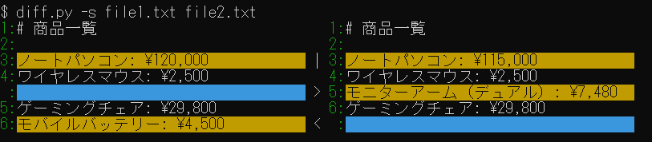
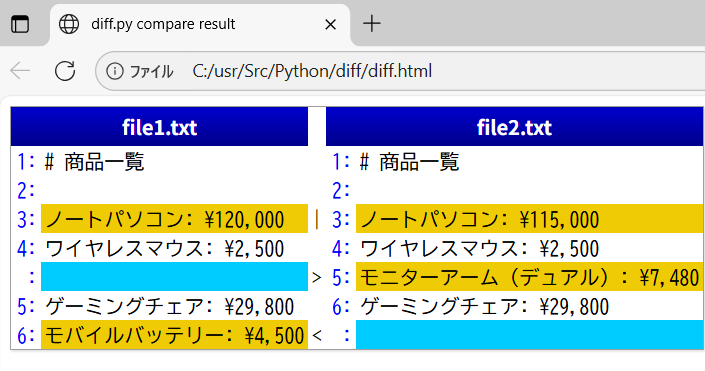
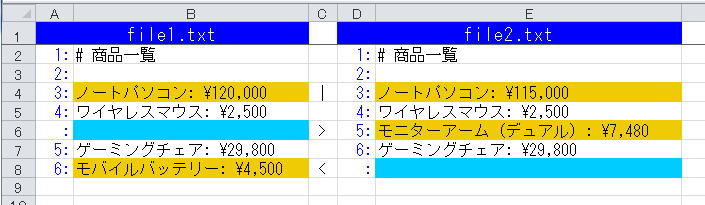

# 🔍 diff.py — ファイル差分比較ツール

`diff.py` は 2 つのファイルを比較し、差分を視覚的に表示・出力する Python スクリプトです。
CLI オプションを使って、テキスト、HTML、Excel 形式での出力や、空白・引用符の違いを無視する設定が可能です。

## 📦 特徴

- 2 ファイル間の差分を比較
- 左右比較表示 (2列形式)
- HTML 形式での出力
- Excel 形式での出力
- タブ幅の指定
- 空白の違いを無視
- 引用符の違いを無視

## 🛠️ 使い方

```bash
python diff.py [OPTIONS] filename1 filename2
```

### 🔧 引数

| 引数 | 説明 |
|------|------|
| `filename1` | 比較対象のファイル1 |
| `filename2` | 比較対象のファイル2 |

### ⚙️ オプション

| オプション | 説明 |
|-----------|------|
| `-h`, `--help` | ヘルプメッセージを表示 |
| `-s`, `--side_by_side` | 左右比較表示 (2列形式) |
| `-m`, `--html` | HTML形式で差分を出力 |
| `-e FILE`, `--xls FILE` | Excel形式で差分を出力 (指定ファイル名) |
| `-x N`, `--tabstop N` | タブ幅を指定 (例: `-x 4`) |
| `-b`, `--ignore_space` | 空白の違いを無視 |
| `-q`, `--ignore_quote` | 引用符の違いを無視 |

## 📋 使用例

```bash
# 通常の差分表示
python diff.py file1.txt file2.txt

# 左右比較表示(2列形式)
python diff.py -s file1.txt file2.txt

# HTML形式で出力
python diff.py -m file1.txt file2.txt > diff.html

# Excel形式で出力
python diff.py -e diff.xlsx file1.txt file2.txt

# 空白と引用符の違いを無視
python diff.py -b -q file1.txt file2.txt
```

## 🖼️ 実行結果スクリーンショット

以下は `diff.py` を使った差分表示の例です：

### 通常の差分表示


### 左右比較表示 (2列形式)


### HTML形式での出力 (ブラウザ表示)


### Excel形式での出力


## 📁 必要環境

- Python 3.6 以上
